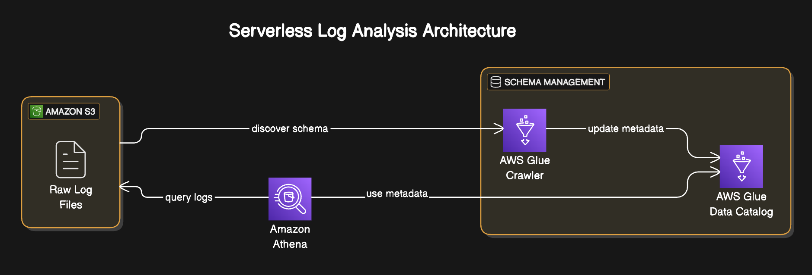
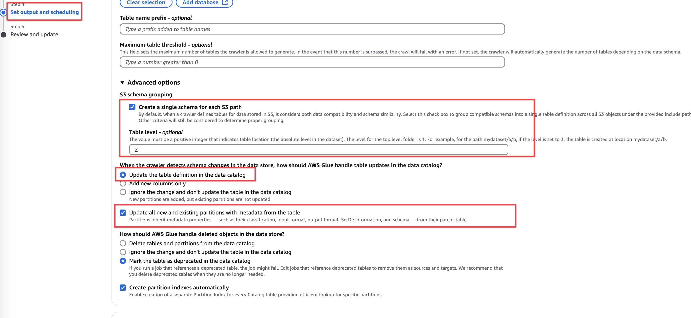

# AWS Glue  - Log Analysis Pipelines

This project implements a `serverless log analysis` solution using **AWS services** to process and analyze application logs. The system automatically discovers log schemas, creates queryable tables, and enables SQL-based analysis without traditional ETL processes or database loading.

Following is the AWS architecture diagram for it.



#### Log Generation

Generate sample log data using Python script `main.py`. This script creates JSON log files with a specified number of entries and partitions them by service, year, month, and day.

I used `faker` library` to generate realistic log entries, including timestamps, log levels, service names, HTTP methods, endpoints, and response times.

Install the dependencies listed in the `requirements.txt` file. You can do this using pip:

```bash
>>> python3 -m pip install -r requirements.txt
```

Then run the script:

```bash
>>> python main.py --days 30 --entries 5000 --output-dir ./logs
```

If you run `python3 main.py` without any `arguments`, it will use the default values for `days`, `entries`, and `output-dir`:

- days = 7
- entries = 1000
- output-dir = ./logs

This will generate JSON log files with the following structure:

- Partitioned by service, year, month, and day
- Each log entry contains fields like timestamp, log level, service name, HTTP method, endpoint, etc.
- Files are named like `logs_api-gateway_20250403.json`

Install `awscli` if you haven't already to proceed with following steps.

And then run `aws configure` to configure `awscli` with `secret key` and `access key`.

#### Amazon S3

Create an `S3 Bucket` to store the generated logs. You can do this using the `awscli`.

```bash
>>> aws s3 mb s3://hack-with-harsha-logs
```

Upload the `generated logs` using `aws s3 sync` command.

```bash
>>> aws s3 sync ./logs s3://hack-with-harsha-logs/logs/ --exclude "*" --include "*.json"
```

#### AWS Glue Crawler 

Use `Glue Crawler` to automatically discover schema and create tables in the `Data Catalog`.

For this, we need to create a role for glue to access the S3 bucket.

> [!IMPORTANT] Try to understand `trust-policy.json` file.. Here, we are attaching this role to `Glue`. so that, only `Glue` can assume this role.

```bash
>>> aws iam create-role \
  --role-name AWSGlueServiceRoleForLogs \
  --assume-role-policy-document file://trust-policy.json \
  --description "IAM Role for AWS Glue Crawler"
```

Attach AWS Managed `Glue Service Role` Policy to the newly created role.

This will allow `crawler` interact with other Glue components like the `Data Catalog`.

```bash
>>> aws iam attach-role-policy \
  --role-name AWSGlueServiceRoleForLogs \
  --policy-arn arn:aws:iam::aws:policy/service-role/AWSGlueServiceRole
```

Put the `Inline Policy` to the `Role`

```bash
>>> aws iam put-role-policy \
  --role-name AWSGlueServiceRoleForLogs \
  --policy-name GlueCrawlerS3Access \
  --policy-document file://glue-crawler-s3-policy.json
```

This is optional, If you want add `tagging` for cost and maintenance purposes.

```bash
>>> aws iam tag-role \
  --role-name AWSGlueServiceRoleForLogs \
  --tags Key=Environment,Value=Production Key=Service,Value=GlueCrawler
```

Create a Glue Crawler

```bash
>>> aws glue create-crawler \
  --name app-logs-crawler \
  --role AWSGlueServiceRoleForLogs \
  --database-name app_logs_db \
  --targets '{"S3Targets": [{"Path": "s3://hack-with-harsha-logs/logs/"}]}'
```

Now, we go to console and edit the crawler like in the screenshot.



- Check ✅ the option `Create a single schema for each S3 path`.
- Set `Table level` to 2
  - `logs/${service}/` → Level 2 (creates tables at the service level)
  - `logs/${service}/${year}/...` → If set to 3, it groups tables by year (not recommended for our case).

With `Table level = 2`, AWS Glue will:

- Create one table per `${service}`
- Automatically detect `year`, `month`, `day` as partitions.

Run the crawler

```bash
>>> aws glue start-crawler --name app-logs-crawler
```

Once complete, the crawler will create tables like `api_gateway`, `authentication`, etc. with the proper schema inferred from the JSON logs.

Now, time to query the logs directly using Athena without having to load them into a database.

#### Amazon Athena

Create an `Athena workgroup` (optional but recommended for cost control).


> [!IMPORTANT] An `Athena workgroup` is a logical container in which your Athena queries run. It allows you to:
> * Separate queries by team, environment, or use case.
> * Track costs and set query limits (so no surprise bills).
> * Define a default S3 output location for query results.
> * Monitor query performance and usage per workgroup.

```bash
>>> aws athena create-work-group \
  --name log-analysis \
  --configuration ResultConfiguration={OutputLocation=s3://hack-with-harsha-logs/query-results/}
```

Sample queries to run in Athena:

```sql
-- Count logs by service and level
SELECT service, level, COUNT(*) as count
FROM "app_logs_db"."api_gateway"
GROUP BY service, level
ORDER BY count DESC;
```

```sql
-- Find slow API responses
SELECT timestamp, endpoint, response_time_ms, status_code
FROM "app_logs_db"."api_gateway"
WHERE response_time_ms > 1000
ORDER BY response_time_ms DESC
LIMIT 100;
```

```sql
-- Error analysis
SELECT date_trunc('hour', from_iso8601_timestamp(timestamp)) as hour,
       service, status_code, COUNT(*) as error_count
FROM "app_logs_db"."api_gateway"
WHERE level = 'ERROR'
GROUP BY 1, 2, 3
ORDER BY hour DESC, error_count DESC;
```

#### Schedule Crawler

Create scheduled crawlers to keep the schema updated as log formats evolve

```bash
# Runs every 6 hours
>>> aws glue update-crawler \
  --name app-logs-crawler \
  --schedule "cron(0 */6 * * ? *)"
```